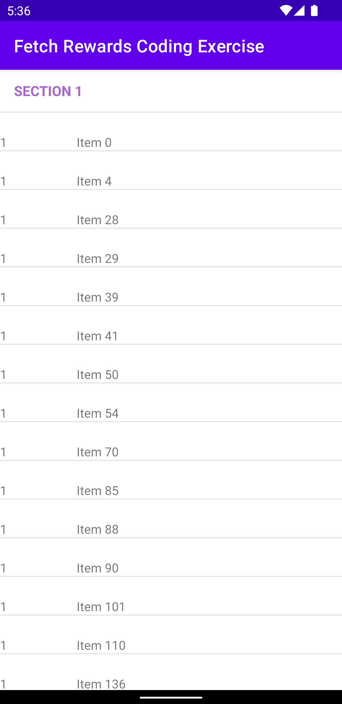
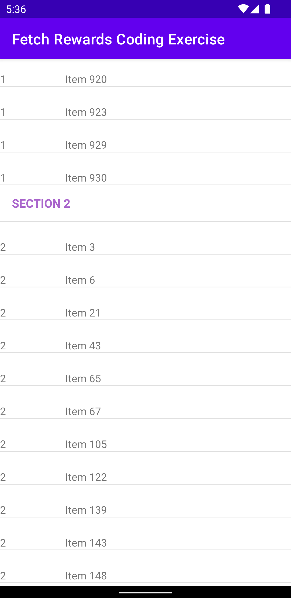
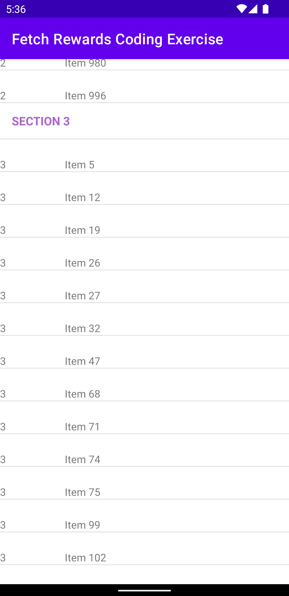
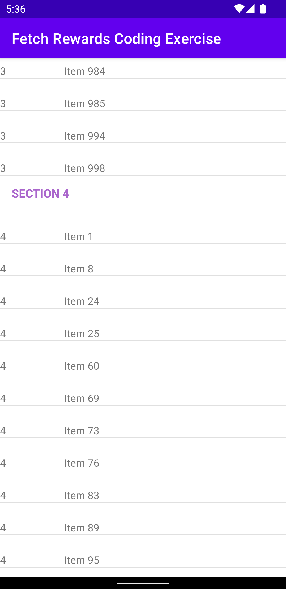

# Fetch Rewards Coding Exercise - Software Engineering - Mobile

This repository contains the code to a native Android app written in Kotlin (and contains some Java) that retrieves data from https://fetch-hiring.s3.amazonaws.com/hiring.json and displays a list of items grouped into sections by "listId", sorted by "listId" then by "name". Items where "name" is blank or null is filtered out.

The `RecyclerView` is sectioned off into multiple sections based on the total number of `listId`s that are present in the data. In theory, if the data contains more than 4 `listId`s, the total number of sections should dynamically increase. The `RecyclerViewAdapter` is adapted from the code [here](https://gist.github.com/gabrielemariotti/4c189fb1124df4556058).

## Build Instructions

1. Clone the repo.
2. Open the project in Android Studio. 3. Sync gradle.
3. Set up your device or emulator first!
4. Build and run the application.

The project was tested on the `Pixel_3a API_32_arm64-v8a` simulator running on `Android API 32`.

### Frameworks used:

- [Gson](https://github.com/google/gson)
- [OkHttp](https://square.github.io/okhttp/)

## Screenshots

